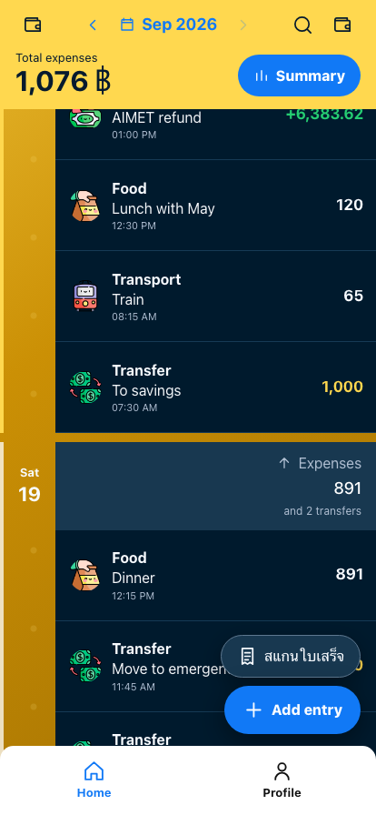
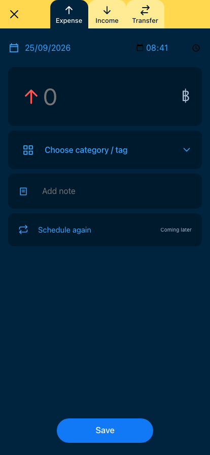
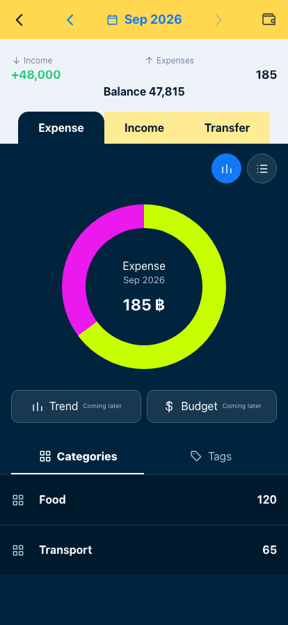

  

<h1 align="center">Ngern Pai Nai</h1>

  <strong>A free money journal for income, expenses, and transfers.</strong> 
  No backend. Your entries stay in your own Google Sheet.

  <a href="docs/features.md">Features</a> ·
  <a href="docs/run-it-yourself.md">Run it yourself</a> ·
  <a href="docs/data-structure.md">Data structure</a>

  <code>Flutter</code>&nbsp;&nbsp;<code>React</code>&nbsp;&nbsp;<code>Google Sheets</code>&nbsp;&nbsp;<code>THB</code>

  
  
  

## Ready-to-eat version

If you trust me, skip the setup and download the ready-to-eat version from the App Store or Google Play.

## Or run it yourself

Prefer to inspect and build the code yourself? Follow [Run it yourself](docs/run-it-yourself.md).

## How is it free?

There is no hosted backend or database to pay for. The app runs on your device and uses Google Sheets for storage.

## Your data is yours

Ngern Pai Nai creates a private spreadsheet named `NgernPaiNai_data` in your Google Drive. It requests the limited `drive.file` permission. Your Google credentials stay in the native app and never enter the React interface. See the [spreadsheet structure](docs/data-structure.md).

## Contributing

Issues and pull requests are welcome. Follow [Run it yourself](docs/run-it-yourself.md) to set up the project and run its checks.

## Support me

If you like the project, consider buying me a cup of coffee.
